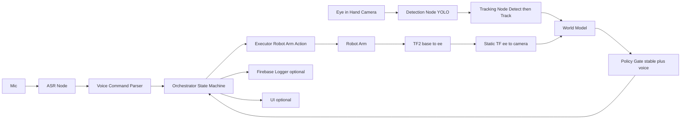
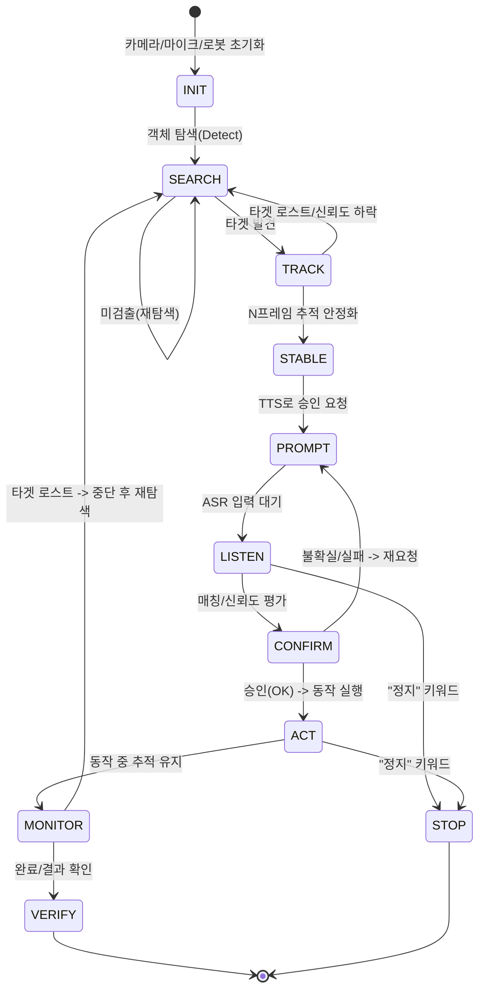

# 경계시스템 자동화 구현 프로젝트 (Eye-in-Hand Camera)
> **Vision(Detect+Track) → 안정화 → TTS 프롬프트 → ASR 승인 → 로봇 동작**  
> 카메라는 **로봇팔 말단(End-Effector)에 장착(Eye-in-Hand)** 된 구성을 전제로 합니다.

---

## 1. 프로젝트 개요
카메라로 **대상 객체를 인식(Detection)** 하고 **동일 객체를 추적(Tracking)** 한 뒤, 시스템이 안내하는 음성 프롬프트에 대해 사용자가 **음성으로 승인(ASR)** 했을 때만 로봇팔이 동작하는 **멀티모달 게이트** 기반 작업 어시스턴트입니다.

- 로봇팔은 **비전+추적+정책**으로 동작 여부를 자체 판단  
- 사용자는 **음성으로 승인/정지/재시도** 등 최소 개입  
- 실행 과정/결과는 **로그 및 Firebase(DB)** 로 기록(추후 선택)

---

## 2. 하드웨어/센서 구성
### Eye-in-Hand(핸드 장착 카메라) 특징
- 카메라가 로봇팔과 함께 움직이므로, 프레임마다 시점이 변합니다.
- 안정적인 판단을 위해 **좌표 변환(TF)** 과 **캘리브레이션(이미 한것)**이 필수입니다.

#### 필수 좌표계(권장)
- `base` : 로봇 베이스
- `ee` : 엔드이펙터(플랜지/툴 프레임)
- `camera` : 카메라 프레임(EE에 고정)
- (선택) `target` : 추적 대상 객체의 추정 포즈

---

## 3. 전체 아키텍처

---

## 4. 상태 머신(동작 흐름)

---

## 5. 단계별 필요한 기술(Flow별 기술 스택)
### INIT
- 카메라: OpenCV / RealSense SDK(선택)
- TF/로봇 상태: ROS2 TF2, 로봇 조인트/포즈 수신
- 로봇 제어: 로봇 SDK 또는 ROS2 Action 기반 Executor
- 오디오: 마이크 입력(PortAudio 등)

### SEARCH (Detection)
- Object Detection: YOLO 계열
- 출력: `class, conf, bbox, timestamp`

### TRACK (Tracking)
- MOT: ByteTrack / SORT / DeepSORT 중 택1  
- 권장: **Detect-then-Track** (카메라가 움직이므로 “재탐지 기반”이 안정적)
- 출력: `track_id, bbox, conf, lost_flag`

### STABLE (Stabilize / 안정화)
- 안정화 조건(예):
  - 동일 `track_id`가 연속 N 프레임 유지
  - conf 임계치 이상
  - (Eye-in-Hand 권장) 화면 픽셀 이동 대신 **base 프레임 상 위치 변화량**으로 안정화 판단(가능 시)

### PROMPT (TTS)
- TTS(로컬/클라우드): “대상 확인됨. ‘시작’이라고 말하면 진행합니다.”

### LISTEN/CONFIRM (ASR + 검증)
- ASR(로컬/서버/클라우드)
- Command Parser: 키워드 기반(시작/정지/재시도/다음) + 신뢰도 게이트
- 타임아웃 및 재요청 로직

### ACT/MONITOR/VERIFY
- Executor: 승인 토큰 없으면 동작 금지
- 실행 중에도 타겟 로스트 감시(중단/재탐색)
- 결과 확인: 비전/센서/IO 조합(선택)

---

## 6. Eye-in-Hand 캘리브레이션/좌표 변환(필수)
### 6.1 Hand-Eye(EE->Camera) 고정 변환
- `T_ee_camera` (static TF): 카메라가 EE에 고정이므로 **한 번 캘리브레이션 후 고정**해서 사용

### 6.2 프레임 변환 흐름(권장)
- 로봇에서 `T_base_ee`를 실시간 수신
- 고정 변환 `T_ee_camera`를 적용하여 `T_base_camera = T_base_ee * T_ee_camera`
- 비전 결과(예: bbox 중심 + depth 또는 pose)를 `camera`에서 얻고, 필요하면 `base`로 변환해 정책/동작에 사용

> 카메라가 움직이기 때문에, “픽셀 기준 안정화”만으로는 흔들릴 수 있어 **가능하면 base 프레임 안정화 기준을 추가**하는 것이 유리합니다.

---

## 7. 권장 MVP 파라미터(초기값)
- Detect conf 임계치: `0.6 ~ 0.7`
- 안정화 프레임 N: `10` (30fps 기준 약 0.3초)
- 로스트 허용 프레임: `5`
- 음성 타임아웃: `3~5초`
- 음성 키워드: `시작 / 정지 / 재시도 / 다음`

---

## 8. ROS2 인터페이스(예시)
- `/vision/detections` (topic)  
  - `detections[]: {class_id, conf, bbox}`
- `/tracking/tracks` (topic)  
  - `tracks[]: {track_id, class_id, conf, bbox, lost}`
- `/voice/transcript` (topic)  
  - `text, confidence, timestamp`
- `/orchestrator/state` (topic)  
  - `state, target_track_id, progress`
- `/robot/execute` (action 또는 service)  
  - `goal: target_track_id, mode, params`
  - `feedback: stage, progress, message`
  - `result: success, fail_code, detail`

---

## 9. Firebase 로깅(선택)
### Firestore 권장 구조(예시)
- `sessions/{sessionId}`  
  - `state`, `started_at`, `ended_at`, `device_id`, `result`
- `sessions/{sessionId}/events/{eventId}`  
  - `type`: `VISION | TRACK | ASR | STAGE | RESULT | ERROR`
  - `payload`: conf, bbox, transcript, score, fail_code 등
  - `timestamp`
- 이미지/스냅샷은 **Storage**에 저장하고 Firestore에는 `storage_path`만 기록

---

## 10. 버전 관리 규칙
### 10.1 버전 번호 규칙
- 형식: **vX.XYZ**
  - `v0.X00` : **기능 구현 변화**(기능 추가/동작 흐름 변경)
  - `v0.0Y0` : **변수/상수/파라미터/리팩토링 변경**
  - `v0.00Z` : **버그 수정**
- 현재 프로젝트 베이스라인(권장): **v0.000**

### 10.2 코드 파일 상단 템플릿(필수)
모든 파이썬 파일 상단을 아래 순서로 통일합니다.

1) `# <filename> vX.XYZ YYYY-MM-DD` (1줄)  
2) `# [이번 버전에서 수정된 사항]` (1줄)  
3) 변경사항 불릿 목록  
4) 모듈 역할/흐름 docstring  
5) import 정렬  
6) ROBOT 상수 및 `DR_init.__dsr__id/__dsr__model` 설정을 DSR_ROBOT2 import 전에 배치  
7) `DEFAULT_` 상수 블록은 파일 상단에 모아두기

---

## 11. 개발 순서(권장 루트)
1) Orchestrator를 더미 입력으로 완성(상태 전이 로그 확인)  
2) Detection 연결 → SEARCH/TRACK 진입 확인  
3) Tracking 연결 → `track_id` 유지/로스트 처리 안정화  
4) TTS/ASR 게이트 연결 → 승인 시에만 ACT 전이  
5) Executor(로봇팔) 연결(초기에는 드라이런/저속)  
6) Firebase 로깅 연결 → 세션 타임라인 저장

---

## 12. 안전/운영 원칙
- “정지”는 어떤 상태에서도 최우선
- 승인(Voice Gate) 없는 동작 금지
- 타겟 로스트 시 중단/재탐색(동작 중에도 추적 유지)
- 핵심 이벤트는 모두 로그/DB로 남겨 디버깅 가능하게

---
